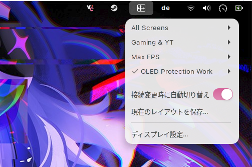

# ミーウニトア (Monitor Layout Switcher)

*[日本語版 README はこちら](README.md)*

Save and switch GNOME monitor layouts (positions, resolution/refresh, scale,
rotation, primary display) — from a top-bar menu, the command line, a keyboard
shortcut, or automatically when you plug/unplug a monitor.

It works on **GNOME Wayland**, where the usual tools (`xrandr`, `autorandr`,
`wlr-randr`) don't, by talking directly to mutter's
`org.gnome.Mutter.DisplayConfig` D-Bus interface.



## Motivation

I was annoyed at having to switch my screens by hand every time I changed what I
was doing — bumping a monitor to a higher refresh rate to get more FPS for
gaming, flipping to a second-screen setup, switching to an OLED-protection
arrangement for work, and so on. This lets me pick the layout I want from the top
bar (or have it applied automatically) instead of clicking through the display
settings each time.

It also fixed a bug I had where my layout was lost after every restart because of
my docking station — applying layouts with mutter's `PERSISTENT` method makes the
configuration survive reboots.

If you need to adapt it for your own setup, feel free to use it — just mention me.

## Components

| Path in repo | Installed to | What it is |
|---|---|---|
| `bin/monitor-layout` | `~/.local/bin/monitor-layout` (+ `ml` alias) | Python CLI that saves/applies layouts via D-Bus |
| `extension/miiunitoa@meeksi39/` | `~/.local/share/gnome-shell/extensions/miiunitoa@meeksi39/` | GNOME Shell extension: top-bar menu that lists saved layouts and applies them |

Saved layouts are stored as JSON in `~/.config/monitor-layouts/` (one file per
layout, e.g. `work.json`). This is **user data** and is not tracked by git.

## Requirements

- GNOME Shell 45–50 on **Wayland**
- Python 3 with PyGObject (`python3-gobject` / `pygobject`) — usually already
  present on a GNOME system
- `~/.local/bin` on your `PATH`

## Install

```sh
git clone git@github.com:Meeksi39/miiunitoa.git ~/miiunitoa
cd ~/miiunitoa
./install.sh                # symlinks the CLI + extension into place
gnome-extensions enable miiunitoa@meeksi39
```

`install.sh` also compiles the extension's GSettings schema (used by the
auto-switch toggle, default layout, and cycle keybinding). If you ever change
the schema, re-run `./install.sh` and reload the shell.

On Wayland you must **log out and back in** for GNOME Shell to load a newly
installed extension (X11 can reload with `Alt+F2` → `r`).

`./install.sh` symlinks by default, so editing files in the repo takes effect
immediately. Other modes:

```sh
./install.sh --copy        # copy files instead of symlinking
./install.sh --uninstall   # remove the symlinks/copies (saved layouts kept)
```

### What install / uninstall do

`install.sh` only ever touches three paths:

- `~/.local/bin/monitor-layout` — the CLI (symlink, or a copy with `--copy`)
- `~/.local/bin/ml` — a symlink alias to the CLI
- `~/.local/share/gnome-shell/extensions/miiunitoa@meeksi39/` — the extension

Installing over an existing **real** file or directory first moves it aside to
`<path>.bak.<timestamp>` so nothing is lost. Re-running the installer is safe.

**Uninstall removes only those three paths.** It never deletes:

- **your saved layouts** in `~/.config/monitor-layouts/` — these are always
  preserved, so you can uninstall and reinstall without losing any layout;
- the `*.bak.*` backups the installer made — they are your pre-install
  originals, so remove them by hand if you no longer want them.

After uninstalling, also disable the extension:

```sh
gnome-extensions disable miiunitoa@meeksi39
```

## Usage

### Save your current setup

Arrange your monitors how you like in **Settings → Displays**, then:

```sh
ml save work        # snapshot the current layout as "work"
ml save fps         # ...and another one
```

### Switch layouts

From the command line:

```sh
ml list             # show saved layouts with a summary of each
ml apply work       # switch to the "work" layout
ml current          # print the current layout (as it would be saved)
ml rename fps game  # rename a saved layout
ml delete fps       # remove a saved layout
ml active           # print the saved layout matching the current config (if any)
ml match            # print saved layouts usable with the connected monitors
ml match --apply    # apply the best matching layout
```

Or from the **top bar**: click the display icon. Each layout expands to a
submenu with **Apply**, **Set as default**, and **Delete**, and shows a one-line
summary (monitor count + connectors). The layout matching your current config is
marked with a checkmark; the default is marked with a ★. "Save current layout…"
opens a dialog to name and snapshot the current setup, and "Display Settings…"
opens GNOME's display panel. The menu rebuilds every time it opens, so layouts
you save from the CLI appear without reloading the extension.

(`ml` is just a short alias for `monitor-layout` — use either.)

### Keyboard shortcut

Press **`Super+P`** to cycle to the next saved layout (in name order). Re-bind it
with dconf if you like:

```sh
dconf write /org/gnome/shell/extensions/miiunitoa/cycle-layouts "['<Super>F8']"
```

### Auto-switch on hotplug

When **Auto-switch on hotplug** is enabled (toggle it in the menu; on by
default), plugging or unplugging a monitor automatically applies the saved
layout that fits the now-connected monitors, with a notification.

A layout *fits* when every connector it uses is currently connected — so a
"docked" layout that disables the laptop panel still fits while docked. When
several layouts fit, the one set as **default** wins; otherwise the one using the
most monitors wins. If two fit equally and there's no default, nothing is applied
(set a default to break the tie). This is the same logic as `ml match`.

### Languages

The extension's menu and notifications are translated into **English, Japanese,
Chinese (Simplified) and Korean**, and follow your GNOME display language
automatically. Translations live in `po/*.po`; `install.sh` compiles them to
`locale/<lang>/LC_MESSAGES/miiunitoa.mo` via `msgfmt`.

To add or update a language, copy `po/miiunitoa.pot` to `po/<lang>.po` (or edit
an existing file), fill in the `msgstr` lines, and re-run `./install.sh`. Keep
the `%s` / `%d` placeholders intact.

## How it works

- **Save** calls `GetCurrentState` on `org.gnome.Mutter.DisplayConfig`, then
  records each logical monitor's position (`x`,`y`), `scale`, `transform`
  (rotation), `primary` flag, and each physical monitor's `connector` (e.g.
  `DP-4`) plus its active `mode_id` (e.g. `1920x1080@200.000`).
- **Apply** reads the saved JSON and calls `ApplyMonitorsConfig` with method
  `PERSISTENT` (2), so the change survives reboots.

### Layout file format

```json
{
  "logical_monitors": [
    {
      "x": 0, "y": 0,
      "scale": 1.0,
      "transform": 0,
      "primary": true,
      "monitors": [
        { "connector": "DP-4", "mode_id": "1920x1080@200.000" }
      ]
    }
  ]
}
```

`transform` values: `0` normal, `1` 90°, `2` 180°, `3` 270°, `4–7` the flipped
variants.

## Troubleshooting

- **"Failed to apply … connectors/modes may not match"** — the saved layout
  references a connector or resolution that isn't available right now (monitor
  unplugged, different port, mode not supported). Re-save the layout for the
  current hardware.
- **Extension doesn't appear** — confirm it's enabled
  (`gnome-extensions list --enabled`) and that you logged out/in on Wayland.
- **`ml: command not found`** — `~/.local/bin` isn't on your `PATH`.
- **No layouts in the menu** — you haven't saved any yet; run `ml save <name>`.

## Development

The repo is the source of truth. With a symlink install, edit
`bin/monitor-layout` and just re-run it; edit the extension and reload GNOME
Shell (log out/in on Wayland). Watch extension logs with:

```sh
journalctl -f -o cat /usr/bin/gnome-shell
```
